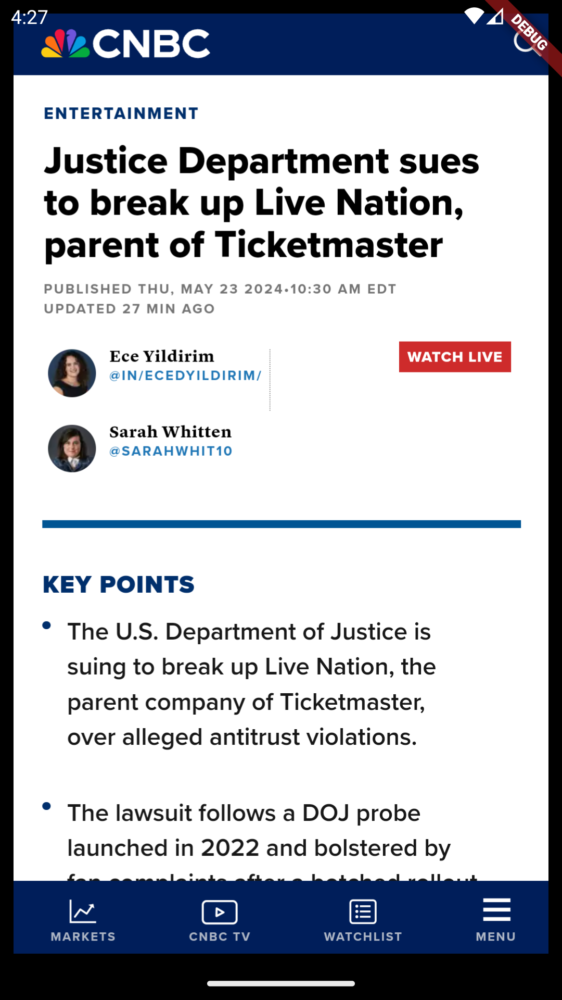

# News App

A news application built with Flutter that displays trending and breaking news articles. The app fetches data from an API and displays it in a user-friendly manner using various widgets and packages.

## Features

- **Trending News:** Displays a list of trending news articles.
- **Breaking News Slider:** Displays breaking news articles in a carousel slider.
- **Detailed Article View:** Opens a detailed view of the article when an item is tapped.
- **Cached Images:** Uses cached images to improve performance and user experience.
- **Smooth Page Indicator:** Indicates the current page in the breaking news slider.

## Dependencies
- cached_network_image
- carousel_slider
- smooth_page_indicator
- http
  
## Screenshots

